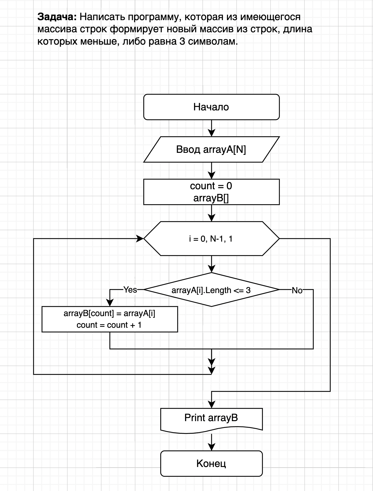

# Итоговая проверочная работа прохождения первого блока обучения на программе Разработчик

### сделала Самохвалова Ирина (гр.3371_17.09.2022)

## Поставленная задача
1. Создать репозиторий на GitHub
2. Нарисовать блок-схему алгоритма (можно обойтись блок-схемой основной содержательной части, если вы выделяете её в отдельный метод)
3. Снабдить репозиторий оформленным текстовым описанием решения (файл README.md)
4. Написать программу, решающую поставленную задачу
5. Использовать контроль версий в работе над этим небольшим проектом (не должно быть так, что всё залито одним коммитом, как минимум этапы 2, 3, и 4 должны быть расположены в разных коммитах)

**Задача:** Написать программу, которая из имеющегося массива строк формирует новый массив из строк, длина которых меньше, либо равна 3 символам. Первоначальный массив можно ввести с клавиатуры, либо задать на старте выполнения алгоритма. При решении не рекомендуется пользоваться коллекциями, лучше обойтись исключительно массивами.

>_**Примеры:**_   
>_[“Hello”, “2”, “world”, “:-)”] → [“2”, “:-)”]_   
>_[“1234”, “1567”, “-2”, “computer science”] → [“-2”]_   
>_[“Russia”, “Denmark”, “Kazan”] → []_
   
## Отчет о проведенной работе
1. Создан репозиторий на GitHub, и привязан к локальной папке.
2. Разработано текстовое описание алгоритма решения задачи:
    - Получаем на вход текстовый массив данных (одномерный)   
    - Используя цикл (от нулевого элемента до последнего) проходим по всем элементам массива и оцениваем их длины, если длина элемента меньше или равна трем символам, то присваиваем следующему элементу нового массива значение оцениваемого элемента.   
    - Полученный массив выводим на печать.
3. При помощи diagrams.net создна блок-схема алгоритма решения задачи.

4. Графический файл блок-схемы добавлен репозиторий.
5. Создан проект консольного приложения для решения задачи согласно разработанному алгоритму. Получен корректный результат выполнения программы.
6. При выполнении проекта использовались инструменты контроля версий. 